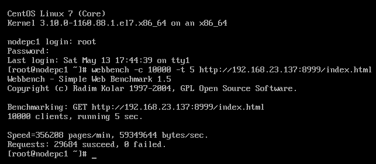

# MyWebServerBASE

## 1. 简介

一个基于epoll的包含线程池、定时器、日志的多进程多线程的WebServer服务器

## 2.压力测试

**测试工具**：Webbench 

**测试环境**：VM ubuntu虚拟机， 处理器数量：2, 每个处理器内核数：2, 内存：4GB 

**测试结果**：

​	1万并发连接持续5s情况下，每分钟处理**35.62万**个请求，数据处理速度为**56.6MB/s**，请求全部成功。

​	
